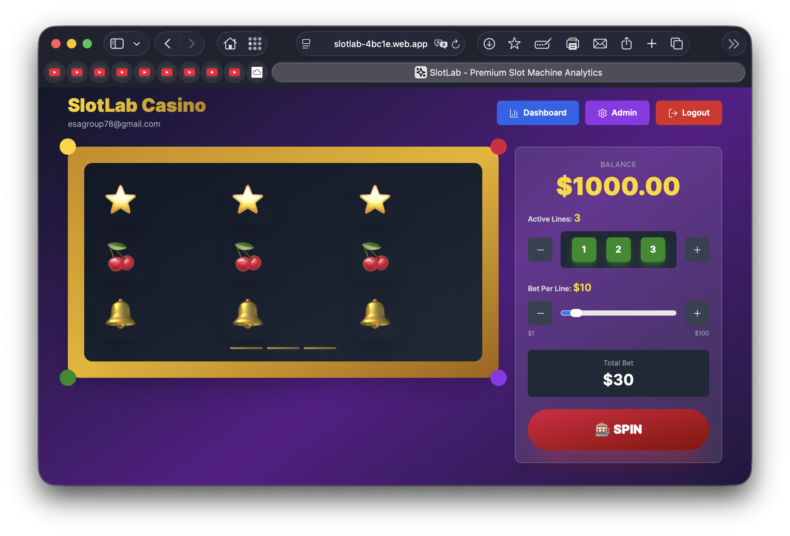
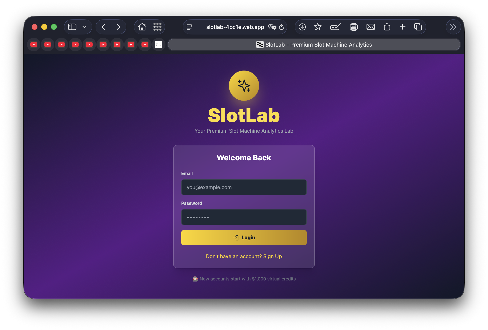
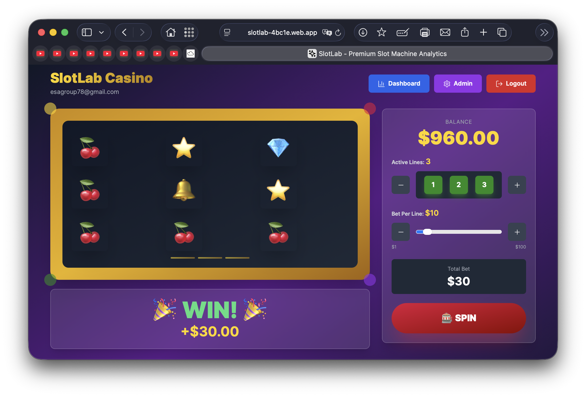
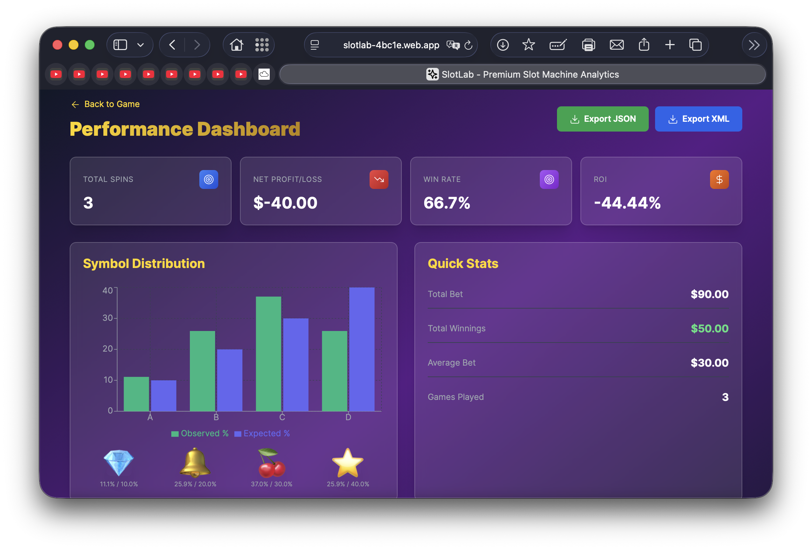

# 🎰 SlotLab

<div align="center">


**A sophisticated full-stack web application combining casino gaming with advanced probability analytics and Monte Carlo simulations.**

[](https://slotlab-4bc1e.web.app)
[](LICENSE)
[](https://firebase.google.com)

<br/>



<br/>

</div>

---

<div align="center">


</div>

## 📋 Table of Contents

### Languages & Core


### Frontend Framework & Styling


### Backend & Database


### Dev Tools & Testing


### Data Formats & Processing


- [Overview](#-overview)
- [Features](#-features)
- [Technology Stack](#-technology-stack)
- [Architecture](#-architecture)
- [Getting Started](#-getting-started)
- [Project Structure](#-project-structure)
- [API Documentation](#-api-documentation)
- [Data Processing](#-data-processing)
- [Testing](#-testing)
- [Deployment](#-deployment)
- [Screenshots](#-screenshots)
- [Contributing](#-contributing)
- [License](#-license)

---

## 🎯 Overview

**SlotLab** transforms a simple slot machine game into a comprehensive data analytics platform. Built with enterprise-grade technologies, it demonstrates real-world application development practices including authentication, database design, API architecture, data visualization, and statistical analysis.

<br/>



<br/>

### What Makes SlotLab Unique?

- 🎲 **Realistic Slot Machine Engine** - Weighted symbol distribution with configurable paylines
- 📊 **Live Analytics Dashboard** - Real-time statistics with interactive charts
- 🔬 **Monte Carlo Simulation Lab** - Run up to 1M simulated spins for probability analysis
- 📈 **ROI & Risk Assessment** - Financial performance tracking with streak analysis
- 💾 **Multi-Format Export** - JSON, XML, and CSV data export capabilities
- 🔐 **Secure Authentication** - Firebase Auth with user-specific data isolation
- 📱 **Responsive Design** - Beautiful UI optimized for desktop and mobile

---

## ✨ Features

### 🎰 Core Gaming

- **3x3 Slot Grid** with animated reels
- **Configurable Betting System**
  - 1-3 active paylines
  - Adjustable bet per line ($1-$100)
  - Real-time balance management
- **Weighted Symbol System**
  - 💎 Diamond (A): 10% probability, 5x multiplier
  - 🔔 Bell (B): 20% probability, 4x multiplier
  - 🍒 Cherry (C): 30% probability, 3x multiplier
  - ⭐ Star (D): 40% probability, 2x multiplier

<br/>



<br/>

### 📊 Analytics Dashboard

- **Performance Metrics**
  - Total spins, wagered, winnings
  - Net profit/loss calculation
  - ROI (Return on Investment)
  - Win rate percentage
- **Symbol Distribution Analysis**
  - Observed vs. Expected probability charts
  - Confidence interval visualization
  - Statistical deviation tracking
- **Session History**
  - Last 50 spins with detailed breakdown
  - Exportable transaction logs
  - Time-series performance tracking

### 🔬 Monte Carlo Simulation

- **Configurable Trial Counts**: 100 to 1,000,000 spins
- **Statistical Outputs**:
  - Win rate distribution
  - Payout frequency analysis
  - Expected value calculation
  - Variance and standard deviation
- **Visual Reports**:
  - Symbol distribution bar charts
  - Payout distribution histograms
  - Performance comparison graphs

### 💾 Data Export & Processing

- **JSON Export** - Full session data with metadata
- **XML Export** - Legacy system compatibility
- **CSV Export** - Spreadsheet-ready format
- **Perl Scripts** for advanced data processing

---

## 🛠️ Technology Stack

### Frontend


- **React 18** - Component-based UI architecture
- **TypeScript** - Type-safe development
- **React Router** - Client-side routing
- **Recharts** - Data visualization library
- **Lucide React** - Icon system
- **Tailwind CSS** - Utility-first styling

### Backend


- **Node.js** - Runtime environment
- **Express.js** - RESTful API framework
- **TypeScript** - Strongly typed backend code
- **Firebase Admin SDK** - Authentication & database management

### Database & Services


- **Firebase Authentication** - Email/password authentication
- **Cloud Firestore** - NoSQL document database
- **Firebase Hosting** - Static site hosting
- **Firebase Cloud Functions** - Serverless backend

### Data Processing


- **Perl Scripts** - ETL & data transformation
- **JSON** - Primary data interchange format
- **XML** - Legacy system export format
- **CSV** - Spreadsheet export

### Testing


- **Mocha** - Test runner
- **Chai** - Assertion library
- **Statistical Tests** - 10k+ spin validation

### Development Tools


---

## 🏗️ Architecture

### System Design

```

┌─────────────────────────────────────────────────────────────┐
│                         CLIENT LAYER                         │
│  ┌──────────────┐  ┌──────────────┐  ┌──────────────┐      │
│  │   Game UI    │  │  Dashboard   │  │   Admin      │      │
│  │  (React)     │  │  (Analytics) │  │ (Simulation) │      │
│  └──────┬───────┘  └──────┬───────┘  └──────┬───────┘      │
│         │                 │                  │              │
│         └─────────────────┴──────────────────┘              │
│                           │                                 │
└───────────────────────────┼─────────────────────────────────┘
│
┌───────▼────────┐
│  Firebase Auth │
│  (JWT Tokens)  │
└───────┬────────┘
│
┌───────────────────────────▼─────────────────────────────────┐
│                      API LAYER (Express)                     │
│  ┌──────────┐  ┌──────────┐  ┌──────────┐  ┌──────────┐   │
│  │  /spin   │  │  /stats  │  │/simulate │  │ /export  │   │
│  └────┬─────┘  └────┬─────┘  └────┬─────┘  └────┬─────┘   │
│       │             │              │             │          │
│       └─────────────┴──────────────┴─────────────┘          │
│                           │                                 │
│              ┌────────────▼────────────┐                    │
│              │   Slot Engine Module    │                    │
│              │  (Pure TypeScript)      │                    │
│              └─────────────────────────┘                    │
└───────────────────────────┬─────────────────────────────────┘
│
┌───────────────────────────▼─────────────────────────────────┐
│                    DATABASE LAYER                            │
│  ┌─────────────────────────────────────────────────────┐    │
│  │              Cloud Firestore (NoSQL)                │    │
│  │  ┌────────────┐  ┌────────────┐  ┌────────────┐   │    │
│  │  │   users/   │  │  /spins/   │  │  /stats/   │   │    │
│  │  │   {uid}    │  │  {spinId}  │  │ {current}  │   │    │
│  │  └────────────┘  └────────────┘  └────────────┘   │    │
│  └─────────────────────────────────────────────────────┘    │
└─────────────────────────────────────────────────────────────┘

```

### Data Flow

1. **User Authentication**
   - User logs in via Firebase Auth
   - JWT token generated and stored
   - Token sent with every API request

2. **Spin Request Flow**
```

User clicks SPIN
→ Frontend validates balance
→ POST /api/spin with lines & betPerLine
→ Backend verifies JWT token
→ Fetches user balance from Firestore
→ Runs slot engine (pure function)
→ Updates balance in Firestore
→ Records spin in user's spin collection
→ Updates aggregated stats
→ Returns result to frontend
→ UI updates with animation & result

````

3. **Real-time Analytics**
- Dashboard fetches `/api/stats`
- Aggregated stats retrieved from Firestore
- Last 50 spins queried with pagination
- Charts rendered with Recharts
- Export buttons trigger download endpoints

### Database Schema

```typescript
// users/{uid}
{
email: string,
balance: number,
createdAt: Timestamp,
lastLoginAt: Timestamp
}

// users/{uid}/spins/{spinId}
{
reels: string[],        // ['A,B,C', 'D,E,F', 'G,H,I']
rows: string[],         // ['A,D,G', 'B,E,H', 'C,F,I']
winnings: number,
totalBet: number,
net: number,
lines: number,
betPerLine: number,
balanceAfter: number,
symbolCountsObserved: { A: 2, B: 3, C: 1, D: 3 },
createdAt: Timestamp
}

// users/{uid}/stats/current
{
totalSpins: number,
totalBet: number,
totalWinnings: number,
netProfit: number,
winRate: number,        // 0.0 - 1.0
avgBetSize: number,
symbolFrequencies: { A: number, B: number, C: number, D: number },
lastUpdated: Timestamp
}
````

---

## 🚀 Getting Started

### Prerequisites

* **Node.js** 18.x or higher
* **npm** 9.x or higher
* **Firebase Account** (free tier)
* **Perl** 5.x (for data processing scripts)

### Installation

1. **Clone the repository**

   ```bash
   git clone https://github.com/yourusername/slotlab.git
   cd slotlab
   ```

2. **Install dependencies**

   ```bash
   # Install server dependencies
   cd server
   npm install

   # Install client dependencies
   cd ../client
   npm install

   # Install function dependencies (if using Cloud Functions)
   cd ../functions
   npm install
   ```

3. **Firebase Setup**

   ```bash
   # Login to Firebase
   firebase login

   # Create a new Firebase project or select existing
   firebase init
   ```

4. **Configure Firebase**

   **Client:** Update `client/src/lib/firebase.ts`

   ```typescript
   const firebaseConfig = {
     apiKey: "YOUR_API_KEY",
     authDomain: "YOUR_PROJECT.firebaseapp.com",
     projectId: "YOUR_PROJECT_ID",
     storageBucket: "YOUR_PROJECT.appspot.com",
     messagingSenderId: "YOUR_SENDER_ID",
     appId: "YOUR_APP_ID"
   };
   ```

   **Server:** Add `firebase-service-account.json`

   * Download from Firebase Console → Settings → Service Accounts
   * Place in `server/` directory

5. **Set Firestore Rules**

   ```bash
   firebase deploy --only firestore:rules
   ```

### Running Locally

**Terminal 1 - Backend Server:**

```bash
cd server
npm run dev
# Server runs on http://localhost:5001
```

**Terminal 2 - Frontend Client:**

```bash
cd client
npm run dev
# Client runs on http://localhost:3000
```

**Access the app:** Navigate to `http://localhost:3000`

---

## 📁 Project Structure

```
slotlab/
├── client/                    # React Frontend
│   ├── src/
│   │   ├── components/        # Reusable UI components
│   │   │   ├── SlotGrid.tsx   # 3x3 slot machine display
│   │   │   ├── Controls.tsx   # Bet controls
│   │   │   ├── StatsCards.tsx # Dashboard stat cards
│   │   │   ├── SpinsTable.tsx # Transaction history
│   │   │   └── SymbolDistribution.tsx
│   │   ├── pages/             # Route pages
│   │   │   ├── Login.tsx      # Authentication
│   │   │   ├── Game.tsx       # Main game interface
│   │   │   ├── Dashboard.tsx  # Analytics dashboard
│   │   │   └── Admin.tsx      # Monte Carlo simulation
│   │   ├── lib/
│   │   │   ├── firebase.ts    # Firebase config
│   │   │   └── api.ts         # API client
│   │   └── types/
│   │       └── index.ts       # TypeScript interfaces
│   ├── public/
│   └── package.json
│
├── server/                    # Express Backend
│   ├── src/
│   │   ├── engine/            # Core game logic
│   │   │   ├── slotEngine.ts  # Spin mechanics
│   │   │   └── types.ts       # Engine types
│   │   ├── routes/            # API endpoints
│   │   │   ├── spin.ts        # POST /api/spin
│   │   │   ├── stats.ts       # GET /api/stats
│   │   │   ├── simulate.ts    # POST /api/simulate
│   │   │   └── export.ts      # GET /api/export/{json,xml}
│   │   ├── middleware/
│   │   │   └── auth.ts        # JWT verification
│   │   ├── db/
│   │   │   ├── firestore.ts   # Firebase Admin setup
│   │   │   └── userService.ts # Database operations
│   │   └── index.ts           # Server entry point
│   ├── test/
│   │   └── slotEngine.test.ts # Mocha/Chai tests
│   └── package.json
│
├── functions/                 # Firebase Cloud Functions
│   ├── src/
│   │   └── index.ts           # Cloud Function exports
│   └── package.json
│
├── scripts/                   # Perl Data Processing
│   ├── analyze_spins.pl       # Statistical analysis
│   ├── compare_sessions.pl    # Session comparison
│   ├── export_to_csv.pl       # CSV converter
│   ├── json_to_xml.pl         # XML converter
│   └── README.md
│
├── firebase.json              # Firebase config
├── firestore.rules            # Database security rules
└── README.md                  # This file
```

---

## 📡 API Documentation

### Base URL

* **Development:** `http://localhost:5001/api`
* **Production:** `https://your-backend.onrender.com/api`

### Authentication

All endpoints require Firebase JWT token in header:

```
Authorization: Bearer <firebase-id-token>
```

---

### Endpoints

#### `POST /init`

Initialize or retrieve user account.

**Response:**

```json
{
  "uid": "user123",
  "email": "user@example.com",
  "balance": 1000,
  "createdAt": "2025-01-15T10:00:00Z"
}
```

---

#### `POST /spin`

Execute a slot machine spin.

**Request:**

```json
{
  "lines": 3,
  "betPerLine": 10
}
```

**Response:**

```json
{
  "reels": [["A","B","C"], ["D","A","B"], ["C","D","A"]],
  "rows": [["A","D","C"], ["B","A","D"], ["C","B","A"]],
  "winnings": 0,
  "totalBet": 30,
  "net": -30,
  "symbolCountsObserved": { "A": 3, "B": 2, "C": 2, "D": 2 },
  "balanceAfter": 970
}
```

**Errors:**

* `400` - Invalid parameters or insufficient balance
* `401` - Unauthorized
* `500` - Server error

---

#### `GET /stats`

Retrieve user statistics and recent spins.

**Response:**

```json
{
  "balance": 970,
  "stats": {
    "totalSpins": 10,
    "totalBet": 300,
    "totalWinnings": 120,
    "netProfit": -180,
    "winRate": 0.3,
    "avgBetSize": 30,
    "roi": -60,
    "observedProbabilities": { "A": 0.11, "B": 0.22, "C": 0.28, "D": 0.39 }
  },
  "recentSpins": [...],
  "expectedProbabilities": { "A": 0.1, "B": 0.2, "C": 0.3, "D": 0.4 }
}
```

---

#### `POST /simulate`

Run Monte Carlo simulation.

**Request:**

```json
{
  "trials": 10000,
  "lines": 3,
  "betPerLine": 10
}
```

**Response:**

```json
{
  "trials": 10000,
  "totalBet": 300000,
  "totalWinnings": 240000,
  "netProfit": -60000,
  "avgReturn": 0.8,
  "roi": "-20.00%",
  "winRate": "35.50%",
  "symbolDistribution": { "A": 0.099, "B": 0.201, "C": 0.298, "D": 0.402 },
  "payoutDistribution": [
    { "payout": 0, "count": 6450, "percentage": "64.50%" },
    { "payout": 20, "count": 2000, "percentage": "20.00%" },
    ...
  ]
}
```

---

#### `GET /export/json`

Download session data as JSON.

**Query Params:**

* `limit` (optional): Number of spins to include (default: 1000)

**Response:** File download

---

#### `GET /export/xml`

Download session data as XML.

**Query Params:**

* `limit` (optional): Number of spins to include (default: 1000)

**Response:** File download

---

## 🔧 Data Processing

### Perl Scripts

Located in `scripts/` directory.

#### Prerequisites

```bash
# Install required Perl modules
cpan JSON
cpan XML::Simple
```

#### 1. Spin Analyzer

Generate comprehensive statistics report.

```bash
perl scripts/analyze_spins.pl slotlab-export-123.json
```

**Output:**

```
============================================================
          SLOTLAB SPIN ANALYSIS REPORT
============================================================

📊 OVERALL STATISTICS
------------------------------------------------------------
Total Spins:           1,234
Total Wagered:         $37,020.00
Total Won:             $29,616.00
Net Profit/Loss:       $-7,404.00
ROI:                   -20.00%
Average Bet:           $30.00

🎯 WIN/LOSS STATISTICS
------------------------------------------------------------
Wins:                  420 (34.04%)
Losses:                814 (65.96%)
Average Win Amount:    $70.51

🔥 STREAK ANALYSIS
------------------------------------------------------------
Longest Win Streak:    8 spins
Longest Loss Streak:   15 spins
...
```

#### 2. CSV Exporter

Convert to Excel-compatible format.

```bash
perl scripts/export_to_csv.pl export.json output.csv
```

#### 3. JSON to XML Converter

```bash
perl scripts/json_to_xml.pl input.json output.xml
```

#### 4. Session Comparator

Compare two gaming sessions.

```bash
perl scripts/compare_sessions.pl session1.json session2.json
```

---

## 🧪 Testing

### Unit Tests

Run the test suite:

```bash
cd server
npm test
```

**Test Coverage:**

* Slot engine mechanics (spin, transpose, getWinnings)
* Symbol distribution validation
* Payout calculation accuracy
* Statistical distribution (10k spin validation)
* Edge cases and error handling

**Example Test Output:**

```
  Slot Engine
    spin()
      ✓ should return 3 reels (columns)
      ✓ should have 3 symbols per reel
      ✓ should only contain valid symbols
    
    Statistical sanity (over many spins)
      ✓ should produce symbol distribution close to expected (10k spins) (2156ms)

  20 passing (2s)
```

### Manual Testing Checklist

* [ ] User registration and login
* [ ] Balance initialization ($1000)
* [ ] Spin with different line configurations
* [ ] Win calculation accuracy
* [ ] Dashboard stat updates
* [ ] Monte Carlo simulation (1k, 10k, 100k trials)
* [ ] JSON/XML export downloads
* [ ] Session persistence across logout/login
* [ ] Mobile responsiveness

---

## 🚀 Deployment

### Firebase Hosting (Frontend)

```bash
# Build production client
cd client
npm run build

# Deploy to Firebase
cd ..
firebase deploy --only hosting
```

**Live URL:** `https://slotlab-4bc1e.web.app`

### Backend Options

#### Option 1: Firebase Cloud Functions

```bash
firebase deploy --only functions
```

#### Option 2: Render.com

1. Create account at [render.com](https://render.com)
2. Connect GitHub repository
3. Deploy `server/` as Web Service
4. Update client API URL

#### Option 3: Railway.app

1. Sign up at [railway.app](https://railway.app)
2. Deploy from GitHub
3. Add environment variables
4. Copy production URL

### Environment Variables

**Backend (.env):**

```
PORT=5001
NODE_ENV=production
GOOGLE_APPLICATION_CREDENTIALS=./firebase-service-account.json
```

**Client:**
Update `client/src/lib/api.ts` with production API URL.

---

## 📸 Screenshots

### Game Interface


### Analytics Dashboard



### Monte Carlo Simulation


### Win Screen


---

## 🎓 Learning Outcomes

This project demonstrates proficiency in:

### Full-Stack Development

* RESTful API design and implementation
* Database schema design (NoSQL)
* Authentication and authorization
* State management in React
* TypeScript type safety

### Data Engineering

* ETL pipelines with Perl
* Multi-format data export (JSON, XML, CSV)
* Statistical analysis and reporting
* Data visualization with charts

### Software Engineering

* Clean architecture principles
* Unit testing with Mocha/Chai
* Version control with Git
* CI/CD deployment strategies
* Security best practices

### Mathematics & Statistics

* Probability distribution modeling
* Monte Carlo simulation methods
* ROI and risk analysis
* Confidence interval calculation

---

## 🤝 Contributing

Contributions are welcome! Please follow these steps:

1. Fork the repository
2. Create a feature branch (`git checkout -b feature/AmazingFeature`)
3. Commit your changes (`git commit -m 'Add some AmazingFeature'`)
4. Push to the branch (`git push origin feature/AmazingFeature`)
5. Open a Pull Request

### Development Guidelines

* Follow TypeScript best practices
* Write tests for new features
* Update documentation
* Use conventional commit messages
* Ensure all tests pass before PR

---

## 📄 License

This project is licensed under the MIT License - see the [LICENSE](LICENSE) file for details.

---

## 👤 Author

**Mahir Ahmed**

* GitHub: [@yourusername](https://github.com/yourusername)
* LinkedIn: [Your LinkedIn](https://linkedin.com/in/yourprofile)
* Email: [your.email@example.com](mailto:your.email@example.com)

---

## 🙏 Acknowledgments

* Firebase team for excellent documentation
* React and TypeScript communities
* Recharts for visualization library
* Tailwind CSS for utility-first styling
* All open-source contributors

---

## 🔗 Links

* **Live Demo:** [https://slotlab-4bc1e.web.app](https://slotlab-4bc1e.web.app)
* **Documentation:** [API Docs](#api-documentation)
* **Report Issues:** [GitHub Issues](https://github.com/yourusername/slotlab/issues)

---

<div align="center">

**Built with ❤️ using modern web technologies**


</div>
```
